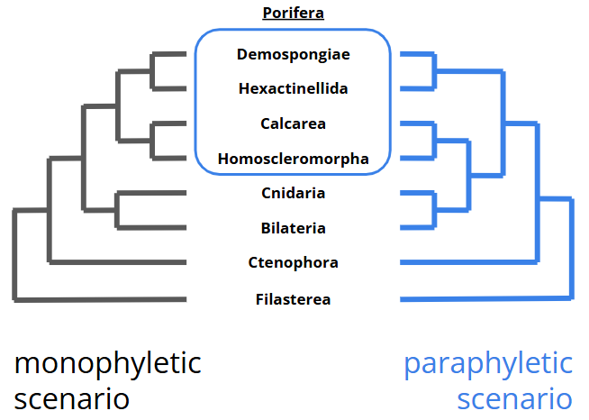
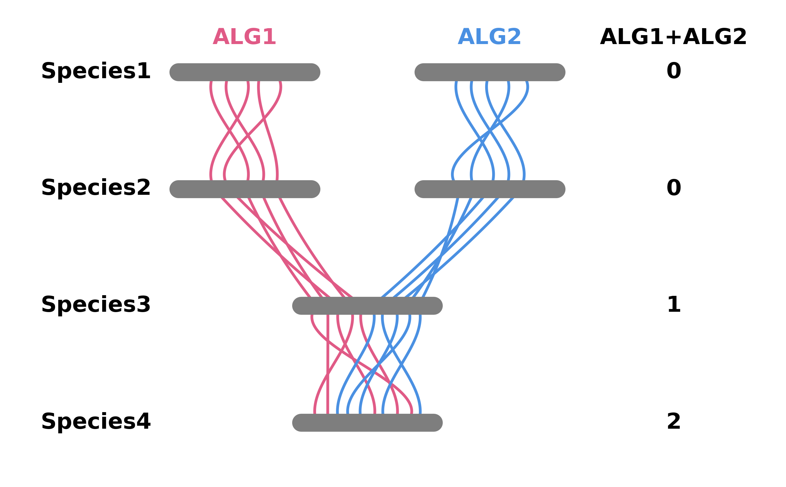
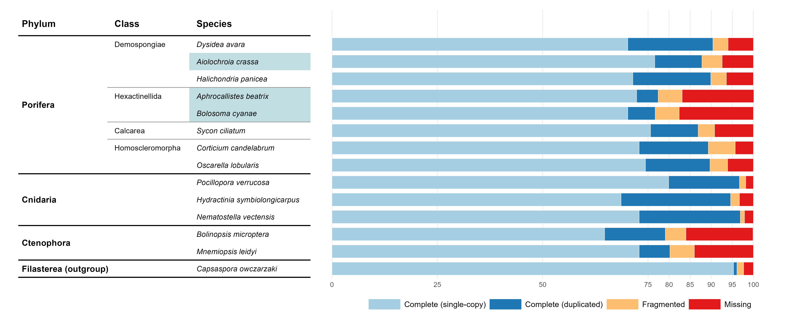
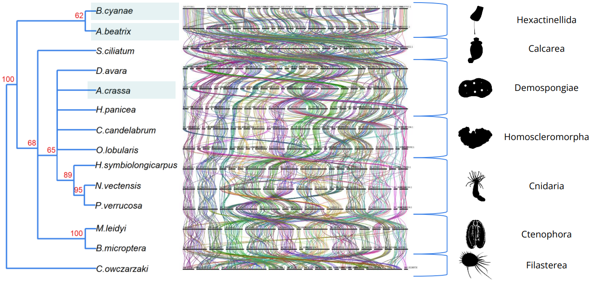

# Inferring deep phylogeny of Sponges (Porifera) using microsyntenies

**Important:** This repository was produced as part of a six-month project at the Bioinformatics Institute (2025/2026).

## Introduction

Sponges (**Porifera**) are an ancient group of multicellular organisms belonging to the subkingdom **Metazoa**. They form an important component of aquatic ecosystems, comprising four extant classes: **Demospongiae**, **Hexactinellida**, **Calcarea** and **Homoscleromorpha**.
### Problem
The phylogenetic topology of classes within the phylum **Porifera** remains a subject of debate:
* **Monophyly:** A number of studies based on multigene sequence evolution suggest a single common ancestor.
* **Paraphyly:** Concurrently, other studies indicate their paraphyletic origin.

Due to the significant evolutionary distance, standard nucleotide sequence analyses produce conflicting data because key phylogenetic markers are often masked by subsequent evolutionary events.
### Approach
To resolve this debate, this project utilizes **microsynteny analysis** (ancestral ortholog linkage groups across different species) as informative characters. Since rearrangements that alter gene order and linkage on chromosomes occur relatively rarely, they serve as reliable markers of evolutionary history.

### Project Goal
The aim of this project is **to resolve the phylogeny of the various classes of Porifera**.

## Materials

The study included **14 species** of multicellular organisms (**Metazoa**) and their closest phylogenetic relatives.
All genome assemblies, proteomes, and available structural annotations were downloaded from the **NCBI** database. For three species (*Aiolochroia crassa*, *Aphrocallistes beatrix* and *Bolosoma cyanae*), gene prediction annotations were missing, so self-annotation was performed based on RNA-seq data.

| Phylogenetic group / Class | Species                         | Accession number              | Annotation status |
| -------------------------- | ------------------------------- | ----------------------------- | ----------------- |
| **Porifera**               |                                 |                               |                   |
| **Demospongiae**           | *Dysidea avara*                 | GCA_963678975.2               | NCBI              |
|                            | *Aiolochroia crassa*            | GCA_964263335.1 / ERR13962532 | Self-annotated    |
|                            | *Halichondria panicea*          | GCA_963675165.1               | NCBI              |
| **Hexactinellida**         | *Aphrocallistes beatrix*        | GCA_963281255.1 / ERR12321229 | Self-annotated    |
|                            | *Bolosoma cyanae*               | GCA_964258925.1 / ERR13962529 | Self-annotated    |
| **Calcarea**               | *Sycon ciliatum*                | GCA_964019385.1               | NCBI              |
| **Homoscleromorpha**       | *Corticium candelabrum*         | GCA_963422355.1               | NCBI              |
|                            | *Oscarella lobularis*           | GCA_947507565.1               | NCBI              |
| **Cnidaria**               | *Pocillopora verrucosa*         | GCA_036669915.2               | NCBI              |
|                            | *Hydractinia symbiolongicarpus* | GCA_029227915.2               | NCBI              |
|                            | *Nematostella vectensis*        | GCA_932526225.1               | NCBI              |
| **Ctenophora**             | *Bolinopsis microptera*         | GCA_026151205.1               | NCBI              |
|                            | *Mnemiopsis leidyi*             | GCA_048537945.1               | NCBI              |
| **Filasterea (outgroup)**  | *Capsaspora owczarzaki*         | GCA_000151315.2               | NCBI              |
## Progress of work

The main stages of the research are automated and presented in the form of sequential bash scripts. The scripts are designed to be run from the project root.

### 1. Sampling
#### Downloading data
To download reference genomes, proteomes, and raw sequencing data, use the following script:
* `0_downloading_data.sh` - automatic download of primary data for analysis.
#### Self-annotation
RNA-seq data processing and gene structure prediction pipeline for three sponge species without available annotations (*A. crassa*, *A. beatrix*, *B. cyanae*):
* `1_qc_and_trimming.sh` - quality control of raw reads (FastQC and MultiQC) and trimming (Fastp).
* `2_prep_for_annotating_three_spongies.sh` - preparation of reference genome indices and alignment of RNA-seq reads (STAR).
* `3_annotating_three_spongies.sh` - running tools for de novo and alignment-based gene prediction (BRAKER).
#### Annotation QC
To check the completeness of the obtained proteomes:
* `4_BUSCO_run.sh` - assessment of the completeness of annotation for conserved orthologs using the BUSCO database.
#### Isoform filtration
For correct microsynteny analysis, it is necessary to retain exactly one (longest) isoform for each gene:
* `5_filtering_isoforms.sh` - removal of alternative transcript isoforms and formation of final reference proteomes (AGAT).

#### Working with the functionality of odp
* `6_gff2chrom.sh`  - converting GFF-files to CHROM-files.
* `7_odp_nway_rbh.sh` - ortholog finding in 3 species.
* `8_odp_rbh_merge.sh` - merging discovered orthologs.
* `9_odp_rbh_to_hmm.sh` - converting into hidden Markov model profiles and searching across the last 10 species by HMMER.
* `10_odp_rbh_to_groupby.sh` - finding ancestral linkage groups.
* `11_odp_groupby_filter.sh` - filtering ancestral linkage groups.
* `12_odp_groupby_to_rbh.sh` - convert groupby to rbh.
* `13_odp_rbh_to_ribbon.sh` - visualization of ancestral linkage groups.
* `14_odp_rbh_plot_mixing.sh` - search for fusion and mixing events.
* `15_get_matrix_nexus.sh` - form a matrix of pairwise comparisons of ancestral linkage groups for each species and write it to a NEXUS file.

#### Using MrBayes
* `16_mrbayes_run.sh` -  launches the MrBayes program.

#### Additional scripts
While standard pipeline steps are automated via Bash scripts and Snakemake workflows utilizing third-party tools, certain analytical stages required custom solutions, which are provided here as `additional_scripts`:
* `annotate_ALGs.py` - used for new numbering ALGs.
* `create_pairwise_rbh.py` - used to create a group of paired rbh-files based on a single ortholog rbh-file.
* `get_matrix_nexus.py` - used to create a character matrix in NEXUS file.
* `to_combine.py` - used to combine files of ALGs.
* `BUSCO_graf.R` - used to draw the BUSCO chart.
* `Tree.R` - used to draw the phylogenetic tree.

## Results
### Sampling
* **De novo structural annotations** of genes for three sponge species (*A. crassa*, *A. beatrix*, and *B. cyanae*) were successfully reconstructed.
* **High-quality proteomes:** The completeness of all 14 proteomes was assessed using BUSCO (against `metazoa_odb12` and `eukaryota_odb12` databases) and **exceeded 75%**, confirming the high quality of the dataset for downstream microsynteny analysis.

### Orthology and Synteny Metrics
The ortholog search and macrosynteny analysis revealed:
* **2,866** orthogroups identified across the studied species.
* **75** ancient linkage groups detected.
* **3,829** fusion and admixture events uncovered throughout the evolutionary history of these taxa.
### Phylogenetic Matrix Generation
A comprehensive character matrix (**14 species × 2,775 pairwise processes**) was generated for subsequent phylogenetic reconstruction. Locus states were encoded discretely based on chromosomal co-localization:
* `0` — Genes are located on **different chromosomes**.
* `1` — Genes are located on the **same chromosome without mixing** (conserved linkage).
* `2` — Genes are located on the **same chromosome with mixing** (rearrangement/admixture).
### Phylogenetic Tree Reconstruction
Bayesian inference was applied to the resulting character matrix to reconstruct the deep phylogenetic relationships among the studied sponge classes.

## Conclusion

The reconstructed phylogenetic tree does not claim to be a global revision of Metazoa evolution, but it successfully highlights several striking genomic phenomena:
* **Paraphyly of Porifera:** The analysis indicates a paraphyletic origin, expressed by the early separation of **Hexactinellida** and **Calcarea**. However, this topology may potentially be an artifact of their accelerated evolutionary rates. For **Hexactinellida**, this divergent signal is consistently confirmed across two distinct species.
* **Clade Topologies (Cnidaria & Sponges):** **Cnidaria** form a classic monophyletic clade that acts as a sister group to the remaining sponges. A polytomy is observed at the base of the node that unites **Cnidaria** with the sponge classes **Demospongiae** and **Homoscleromorpha**.
* **Isolation of Ctenophora:** **Ctenophora** became completely isolated from the other studied groups. Despite this deep divergence, they have retained a remarkably high level of internal similarity in their macrosynteny patterns.

## Requirements

### Hardware
The analysis was performed on the Skoltech HPC Cluster using the **SLURM** workload manager. And these resources are guaranteed to be sufficient to replicate the results:
* **RAM:** 128 GB
* **CPU:** 48 cores

### Software
To replicate the analysis and run the scripts, the following tools are required:
* **QC & Preprocessing:** `FastQC`, `MultiQC`, `fastp`, `RepeatMasker`.
* **Alignment & Mapping:** `STAR`, `SAMtools`.
* **Gene Prediction & QC:** `BRAKER3`, `BUSCO`, `AGAT`
* **Synteny Analysis:** [`odp`](https://github.com/conchoecia/odp) (including built-in modules `DIAMOND` и `HMMER`, and and `Python 3.12` as the interpreter language).
* **Phylogenetics:** `MrBayes`
* **Visualization:** `R` (with the installed packages `ape`, `ggplot2`, `patchwork`, `dplyr` and `tidyr`).

## Contributors

* **Students:**
	* Roman Zhidkin - Saint Petersburg State University, Bioinformatics Institute
	* Anton Shaposhnikov - Saint Petersburg State University, Bioinformatics Institute
* **Supervisors:**
	* Vasiliy Zubarev - Skolkovo Institute of Science and Technology
	* Leonid Sidorov - Skolkovo Institute of Science and Technology

